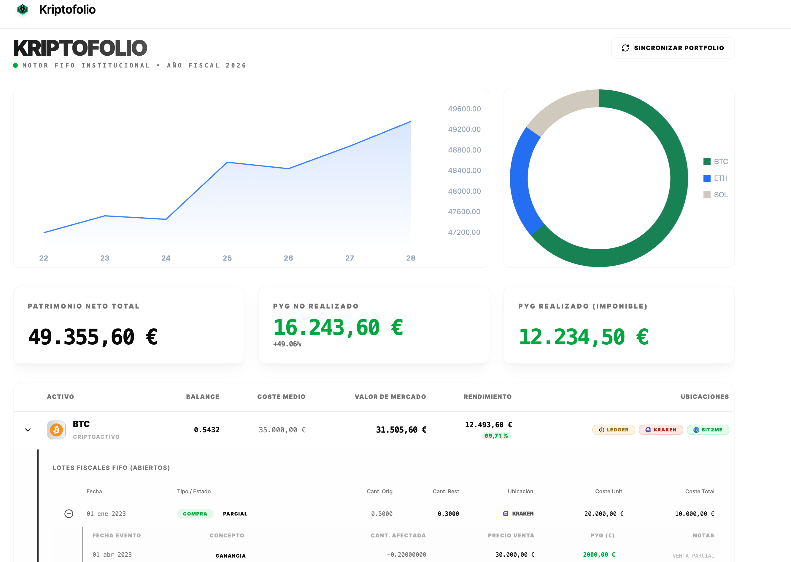
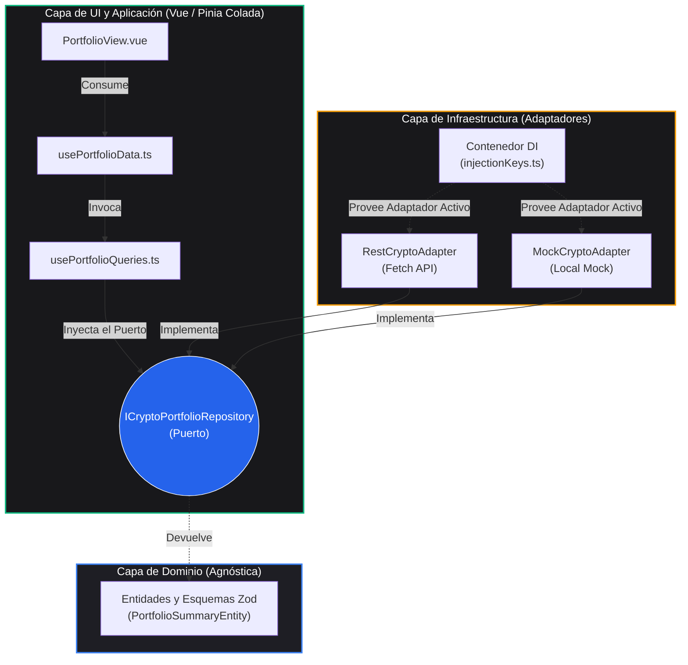

# 📊 Kryptofolio

[](https://github.com/nelomr/kryptofolio/releases/latest)
[](https://github.com/nelomr/kryptofolio/actions/workflows/ci.yml)
[](./CHANGELOG.md)

> 🌍 **Leer en:** [English](README.md) | [Español](README.es.md)



> **Kryptofolio** es un dashboard de portafolio cripto y fiscal de código abierto, construido con Vue 3 y Arquitectura Limpia (Clean Architecture). Diseñado como una plataforma de visualización pura que utiliza un sistema estricto FIFO para la presentación de datos, y técnicamente preparado para una integración fluida con Agentes de IA (Vercel AI SDK + Mastra).

## ✨ Características Principales

- **📊 Presentación de Datos basada en FIFO:** Informes de saldos y transacciones precisos y fiables utilizando una metodología First-In-First-Out (FIFO) para estructurar la lógica de visualización.
- **🤖 Preparado para Agentes de IA:** Los modelos de datos del frontend están desacoplados y diseñados específicamente para ser consultados por una futura integración de Agentes de IA (usando Vercel AI SDK y Mastra). Podrás hacer preguntas en lenguaje natural sobre tu portafolio en tiempo real.
- **🛡️ Privacidad Primero:** Totalmente self-hosted. El backend utiliza una base de datos SQLite local (`fiscal.db`), asegurando que tus claves y tu historial de transacciones nunca salgan de tu máquina.
- **🏗️ Arquitectura Hexagonal:** Estricta separación de responsabilidades (Puertos y Adaptadores). La capa de UI está completamente desacoplada de la obtención de datos, permitiendo una alta testabilidad y validación robusta en tiempo de ejecución mediante Zod.

## 🛠️ Stack Tecnológico

- **Framework**: Vue 3 (Composition API + `<script setup>`)
- **Gestión de Estado**: [Pinia](https://pinia.vuejs.org/) + [Pinia Colada](https://pinia-colada.esm.dev/)
- **Estilos**: TailwindCSS 4
- **Gráficos**: Lightweight Charts (TradingView)
- **Testing**: Vitest
- **Gestor de Paquetes**: pnpm

## 🚀 Inicio Rápido

### Configuración del Entorno

Antes de ejecutar el proyecto, debes configurar tus variables de entorno.
Copia los archivos de ejemplo proporcionados para crear tus entornos locales:

```bash
# Para desarrollo
cp .env.example .env

# Para producción
cp .env.production.example .env.production
```

**Variables Clave:**
- `VITE_USE_MOCK`: Configúralo en `true` para usar los adaptadores mock locales (útil si no tienes el backend de Python ejecutándose localmente). Configúralo en `false` para usar los adaptadores reales de la API REST.
- `VITE_API_BASE_URL`: La URL del backend de Python (ej. `http://localhost:8000`).

---

### 💻 Desarrollo Local

Asegúrate de tener [pnpm](https://pnpm.io/) instalado.

```bash
# 1. Clonar el repositorio
git clone https://github.com/nelomr/portfolio-dashboard.git
cd portfolio-dashboard

# 2. Instalar dependencias
pnpm install

# 3. Iniciar el servidor de desarrollo (con HMR)
pnpm dev
```

### 🧪 Pruebas y Validación

Aplicamos estrictos controles de calidad (Arquitectura Limpia y TDD). Ejecuta estos comandos para validar tus cambios localmente antes de enviar una PR:

| Comando | Descripción |
|---------|-------------|
| `pnpm dev` | Inicia el servidor de desarrollo local. |
| `pnpm test` | Ejecuta la suite completa de pruebas unitarias de **Vitest** (Adaptadores, UI y Dominio). |
| `pnpm test:ui` | Abre el dashboard de interfaz de Vitest para la depuración interactiva de pruebas. |
| `pnpm typecheck` | Ejecuta **Vue-TSC** para validar estáticamente los tipos en todos los componentes sin emitir archivos de salida. |
| `pnpm build` | Compila y empaqueta la aplicación para su despliegue en producción. |

## 📦 Arquitectura: Hexagonal (Puertos y Adaptadores)

Este proyecto se adhiere estrictamente a la **Arquitectura Limpia** (Clean Architecture) para asegurar que la interfaz de usuario esté completamente desacoplada de la obtención de datos, contratos de API y dependencias externas.



### 🏛️ Capas Arquitectónicas

1. **Capa de Dominio (`src/core/domain/`)**
   El corazón de la aplicación. No tiene dependencias externas de frameworks.
   - **Entidades y Objetos de Valor (`models/`)**: Definidos usando TypeScript y `zod` para validación estricta en tiempo de ejecución.
   - **Puertos (`repositories/`)**: Interfaces que definen el contrato para las operaciones de datos. El dominio dicta *qué* necesita, no *cómo* obtenerlo.

2. **Capa de Infraestructura (`src/core/infrastructure/`)**
   El borde exterior que se comunica con el mundo real.
   - **Adaptadores (`adapters/`)**: Implementaciones concretas de los puertos del dominio. (ej. `RestCryptoAdapter` o `MockCryptoAdapter`).
   - **Inyección de Dependencias (`di/`)**: El "Composition Root". Evalúa las variables de entorno e instancia el adaptador correcto.

3. **Capa de Aplicación y Presentación (`src/composables/queries/` & `src/views/`)**
   - Utilizamos `@pinia/colada` para gestionar de forma declarativa la obtención asíncrona de datos. Las vistas actúan puramente como orquestadores.

### 🛡️ Consumo de API y Validación Zod

Para evitar que la UI falle por cambios inesperados en la API del backend, empleamos una estricta **capa anticorrupción**:
La respuesta en bruto se pasa a través de esquemas Zod. Si el backend devuelve datos malformados, Zod lo intercepta de inmediato, evitando cuelgues en tiempo de ejecución.

## 🤖 Guías para Agentes y Arquitectura UI

Este proyecto utiliza un enfoque de equipo de agentes de IA vía `.agent/skills` para forzar la arquitectura:
- **Componentes UI (shadcn-vue)**: Deben generarse vía CLI (`pnpm dlx shadcn-vue@latest add <component>`).
- **Gestión de Estado**: Datos asíncronos vía `@pinia/colada`, estado síncrono vía Pinia.
- **Vue Core**: Solo API de Composición (`<script setup>`) y priorizamos Composables.

## 🔖 Versionado (Versioning)

Este proyecto sigue el [Versionado Semántico](https://semver.org) (`MAJOR.MINOR.PATCH`) y usa [Conventional Commits](https://www.conventionalcommits.org) para automatizar las releases.

| Tipo de Commit | Salto de Versión | Ejemplo |
|-------------|-------------|---------|
| `feat: ...` | **minor** `0.x.0` | Nueva característica |
| `fix: ...` | **patch** `0.0.x` | Corrección de bug |
| `feat!: ...` o `BREAKING CHANGE:` | **major** `x.0.0` | Cambio que rompe compatibilidad |
| `docs: / test: / chore: / perf: / refactor:` | **ninguno** | Documentación, pruebas, refactor |

> ⚠️ **Ritmo de Versionado (Release Rules):** Para evitar un avance descontrolado de versiones por pequeños cambios técnicos, **solo los commits `feat` (minor) y `fix` (patch) generarán nuevas versiones**. Los commits de tipo `docs`, `refactor`, `test` y `perf` registrarán el cambio en git, pero *no* forzarán una subida de versión en `package.json` ni crearán una nueva release en GitHub.

Cada push a `main` dispara la pipeline CI. Si se detectan commits válidos (`feat` o `fix`), `semantic-release` automáticamente:
1. Actualiza la versión en `package.json` y hace commit.
2. Actualiza el `CHANGELOG.md` (con el título principal "Kriptofolio").
3. Crea una Release en GitHub con las notas generadas.
4. Etiqueta el commit (`vX.Y.Z`).

## 📄 Licencia

Este proyecto es de código abierto bajo la [Licencia MIT](LICENSE).
