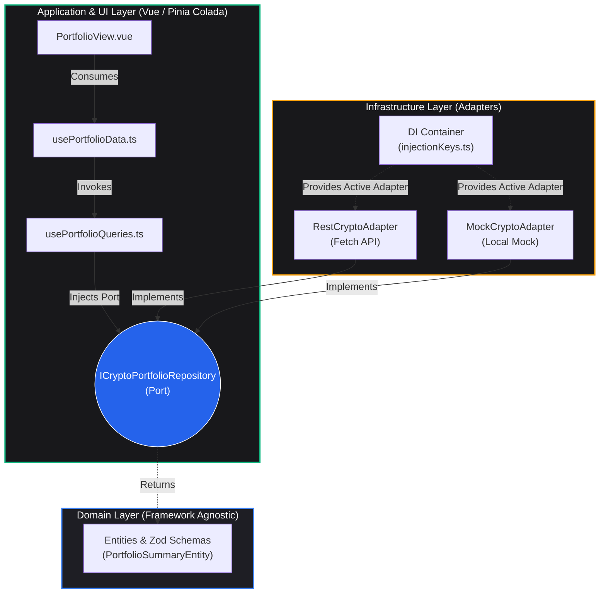

# Portfolio Dashboard

[](https://github.com/nelomr/portfolio-dashboard/releases/latest)
[](https://github.com/nelomr/portfolio-dashboard/actions/workflows/ci.yml)
[](./CHANGELOG.md)

A professional and modern crypto portfolio dashboard.

## 🛠️ Stack

- **Framework**: Vue 3 (Composition API + `<script setup>`)
- **State Management**: [Pinia](https://pinia.vuejs.org/) + [Pinia Colada](https://pinia-colada.esm.dev/)
- **Styling**: TailwindCSS 4
- **Charts**: Lightweight Charts (TradingView)
- **Testing**: Vitest
- **Package Manager**: pnpm

## 📦 Architecture: Hexagonal (Ports & Adapters)

This project strictly adheres to **Clean Architecture** (specifically the **Hexagonal / Ports and Adapters** pattern) to ensure the UI is completely decoupled from data fetching, API contracts, and external dependencies. This enables high testability, seamless swapping of data sources (e.g., Mock vs Real API), and protects our core domain logic.



### 🏛️ Architectural Layers

1. **Domain Layer (`src/core/domain/`)**
   The heart of the application. It has zero external framework dependencies (not even Vue or Axios).
   - **Entities & Value Objects (`models/`)**: Defined using TypeScript and `zod` for strict runtime validation and type safety (e.g., `PortfolioSummaryEntity`).
   - **Ports (`repositories/`)**: Interfaces that define the contract for data operations (e.g., `ICryptoPortfolioRepository`). The Domain dictates *what* it needs, not *how* to get it.

2. **Infrastructure Layer (`src/core/infrastructure/`)**
   The outer edge that communicates with the real world.
   - **Adapters (`adapters/`)**: Concrete implementations of the Domain Ports. For example, `RestCryptoAdapter` connects to the real Python API, while `MockCryptoAdapter` provides offline mock data for local development.
   - **Dependency Injection (`di/`)**: The "Composition Root". It evaluates environment variables (`VITE_USE_MOCK`) and instantiates the correct adapter, providing it globally to the application via Vue's injection mechanism (`PORTFOLIO_REPO_KEY`).

3. **Application & Presentation Layer (`src/composables/queries/` & `src/views/`)**
   - **Asynchronous Queries (`src/composables/queries/`)**: We use `@pinia/colada` (`useQuery`/`useMutation`) to declaratively manage asynchronous data fetching, caching, and invalidation. These composables (e.g., `usePortfolioQueries.ts`) consume the injected Repositories and expose pure reactive states (`isFetching`, `data`, `error`). Traditional Pinia stores are strictly reserved for synchronous global UI state; we do not build manual async state machines.
   - **UI Orchestrators & Components**: Views read directly from the query composables or orchestrator composables. They never make direct HTTP calls or track manual loading flags.

### 🛡️ API Consumption & Zod Validation

The dashboard connects to an external Python backend. To prevent the UI from crashing or behaving unpredictably due to API contract changes, we employ a strict **anti-corruption layer**:

1. **Data Fetching**: The `RestCryptoAdapter` (Infrastructure) makes native `fetch` requests to the API endpoints (e.g., `/api/v1/portfolio/summary`).
2. **Runtime Validation**: Instead of blindly casting the JSON response using TypeScript's `as Type` (which only exists at compile-time), the raw response is passed through **Zod schemas** (e.g., `PortfolioSummarySchema.parse(response)`).
3. **Graceful Failures**: If the backend returns malformed data or a missing field, Zod immediately intercepts it. The adapter catches the `ZodError`, emits a detailed log to the internal `errorBus`, and protects the application from catastrophic runtime crashes.

## 🤖 Agent Guidelines & UI Architecture

This project utilizes an AI Agent Team approach via `.agent/skills` to strictly enforce architecture:
- **UI Components (shadcn-vue)**: All base components MUST be generated via the CLI (`pnpm dlx shadcn-vue@latest add <component>`). Manual base components are strictly forbidden. The system utilizes `radix-vue` for accessibility and `class-variance-authority` (cva) for styling variants.
- **State Management**: Asynchronous data must be fetched using `@pinia/colada` (`useQuery`/`useMutation`), while standard Pinia setup stores are reserved for synchronous UI state.
- **Vue Core**: We strictly adhere to the Vue 3 Composition API (`<script setup>`) and prioritize reusable Composables over bloated component logic.

## 🧱 Component & View Structure

To maintain clean and scalable code, we follow a strict separation of concerns for UI components and views:

- **Views (`src/views/`)**: Views act as **pure orchestrators**. They should NOT contain complex computed logic, state mutations, or heavy inline templates. A view's responsibility is to assemble components and provide them with data obtained from composables.
- **Domain Components (`src/components/<domain>/`)**: Components specific to a domain (e.g., `portfolio/`) are extracted to keep views clean. They should be focused on presentation and rely on props for data. Examples include `PortfolioHeader.vue`, `MetricCard.vue`, `MetricsRow.vue`, etc.
- **Composables (`src/composables/` or `src/views/<view>/composables/`)**: All derived logic, data fetching orchestration, and complex computations must be extracted into composables. For example, `usePortfolioMetrics` handles presentation-level PnL derivations, keeping the view clean.
- **UI Base Components (`src/components/ui/`)**: Reusable, generic UI components generated by shadcn-vue.

### Example: Portfolio Module

```text
src/
├── composables/
│   ├── queries/                   # Pinia Colada async data fetching
│   │   └── usePortfolioQueries.ts
│   ├── useFormatters.ts           # Formatters for UI data
│   └── usePortfolioMetrics.ts     # Presentation logic (pnlValue, roiPercentage, isBullish)
│
├── components/
│   ├── charts/
│   │   ├── PerformanceLineChart.vue
│   │   └── AssetAllocationChart.vue
│   └── portfolio/                 # Domain-specific isolated components
│       ├── PortfolioHeader.vue    # Header + pulse + rebuild button
│       ├── MetricCard.vue         # Generic card (label + slot)
│       ├── MetricsRow.vue         # 3 MetricCards composite
│       └── ChartsRow.vue          # 2 charts with v-if guards
│
└── views/Portfolio/
    ├── composables/
    │   ├── useChartData.ts        # Chart formatting & synthetic performance data
    │   └── usePortfolioData.ts    # Pinia Colada query orchestration
    └── PortfolioView.vue          # Pure orchestrator, assembles above pieces
```

## 🚀 Getting Started

### Environment Configuration

Before running the project, you must configure your environment variables. 
Copy the provided example files to create your local environments:

```bash
# For development
cp .env.example .env

# For production
cp .env.production.example .env.production
```

**Key Variables:**
- `VITE_USE_MOCK`: Set to `true` to use the local mock adapters (useful if you don't have the Python backend running locally). Set to `false` to use the real REST API adapters.
- `VITE_API_BASE_URL`: The URL of the Python backend (e.g., `http://localhost:8000`).

---

### Installation & Running

1. **Install dependencies**:

   ```bash
   pnpm install
   ```

2. **Start the development server**:

   ```bash
   pnpm dev
   ```

3. **Run tests**:

   ```bash
   pnpm test
   ```

4. **Type check**:

   ```bash
   pnpm typecheck
   ```

## 🔖 Versioning

This project follows [Semantic Versioning](https://semver.org) (`MAJOR.MINOR.PATCH`) and uses [Conventional Commits](https://www.conventionalcommits.org) to automate releases.

| Commit type | Version bump | Example |
|-------------|-------------|---------|
| `feat: ...` | **minor** `0.x.0` | New feature added |
| `fix: ...` | **patch** `0.0.x` | Bug fix |
| `perf: ...` | **patch** `0.0.x` | Performance improvement |
| `refactor: ...` | **patch** `0.0.x` | Code refactor |
| `feat!: ...` or `BREAKING CHANGE:` | **major** `x.0.0` | Breaking change |
| `docs: / test: / chore:` | **patch** or none | Docs, tests, maintenance |

Every push to `main` triggers the CI pipeline. If releasable commits are detected, `semantic-release` automatically:
1. Bumps the version in `package.json`
2. Updates `CHANGELOG.md`
3. Creates a GitHub Release with generated notes
4. Tags the commit (`vX.Y.Z`)

See all releases → [GitHub Releases](https://github.com/nelomr/portfolio-dashboard/releases)
See full history → [CHANGELOG.md](./CHANGELOG.md)

## 📄 License

This project is open-source under the [MIT License](LICENSE).
